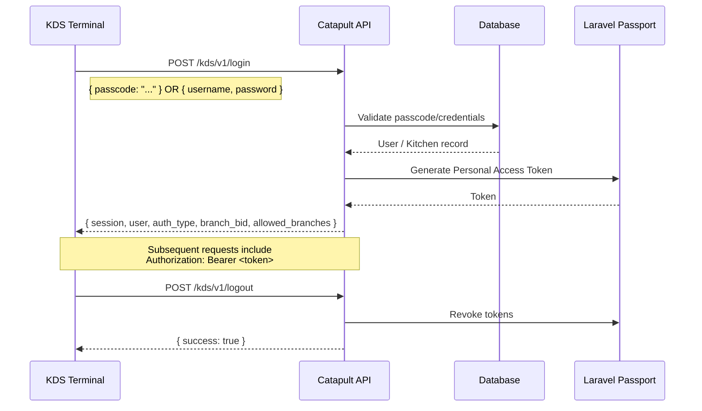
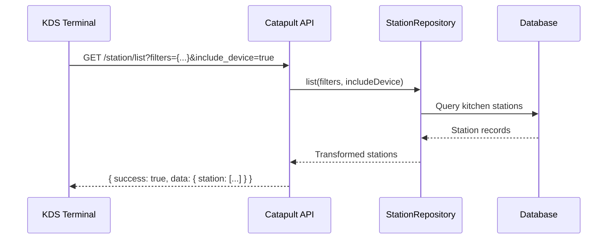
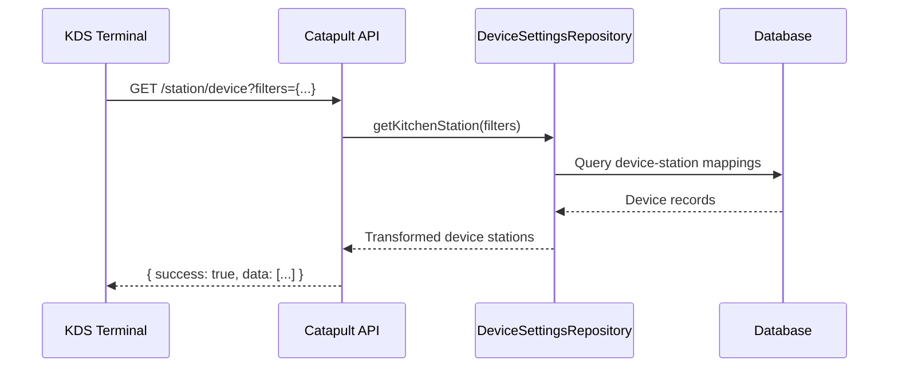
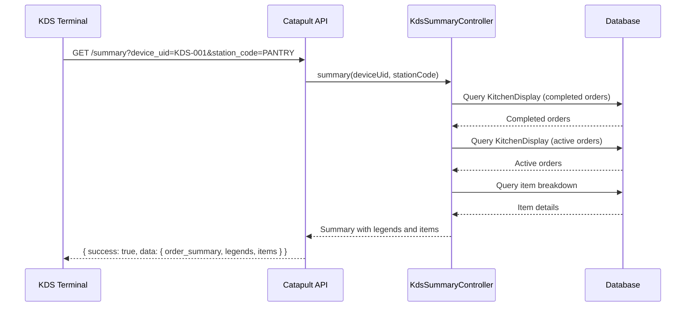
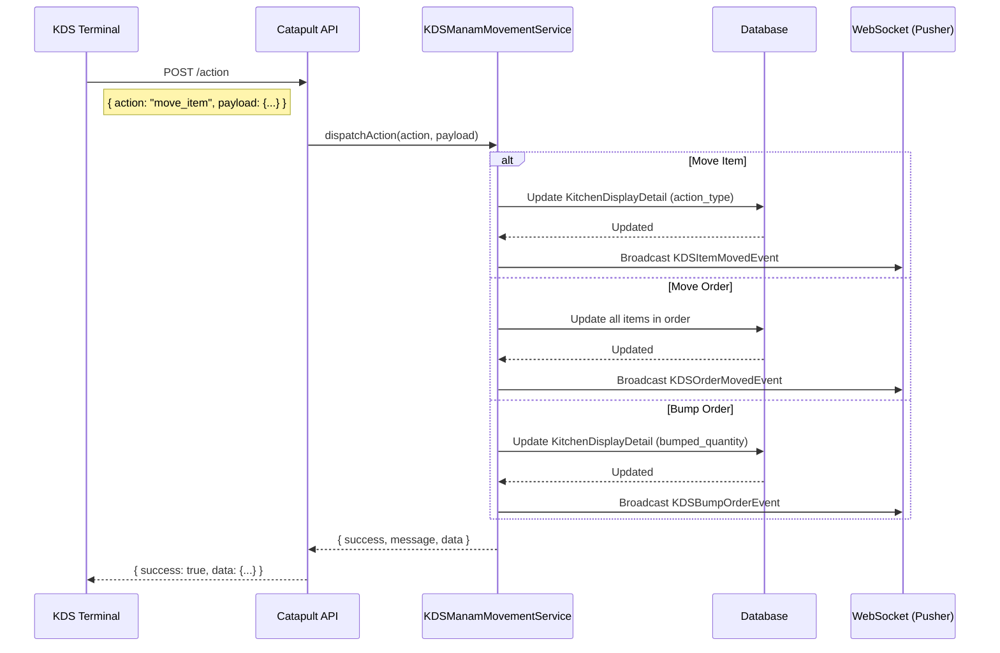
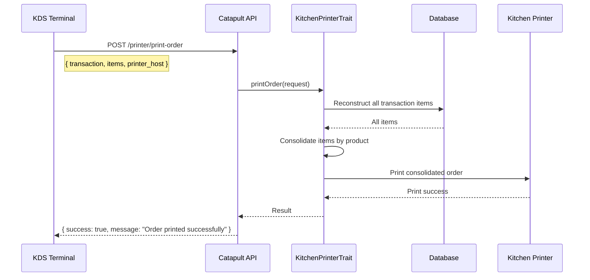
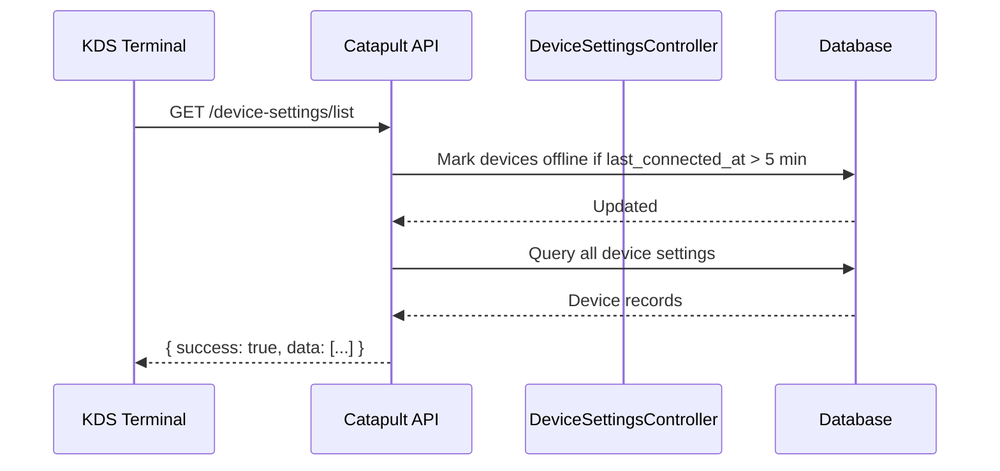
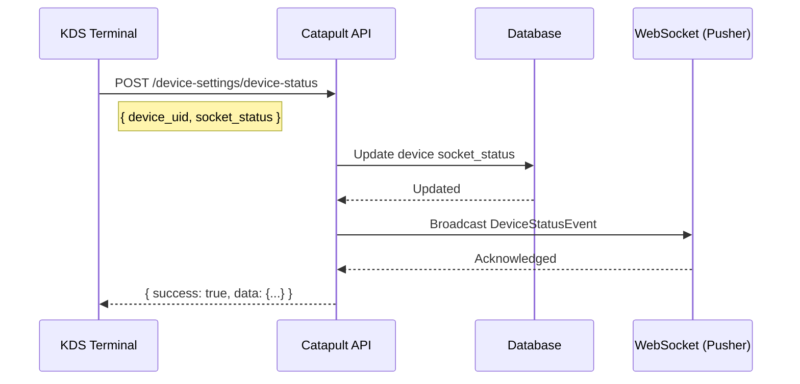
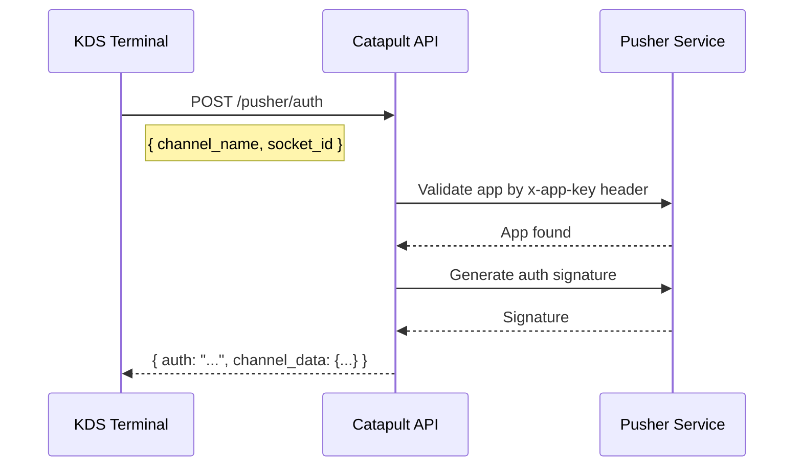
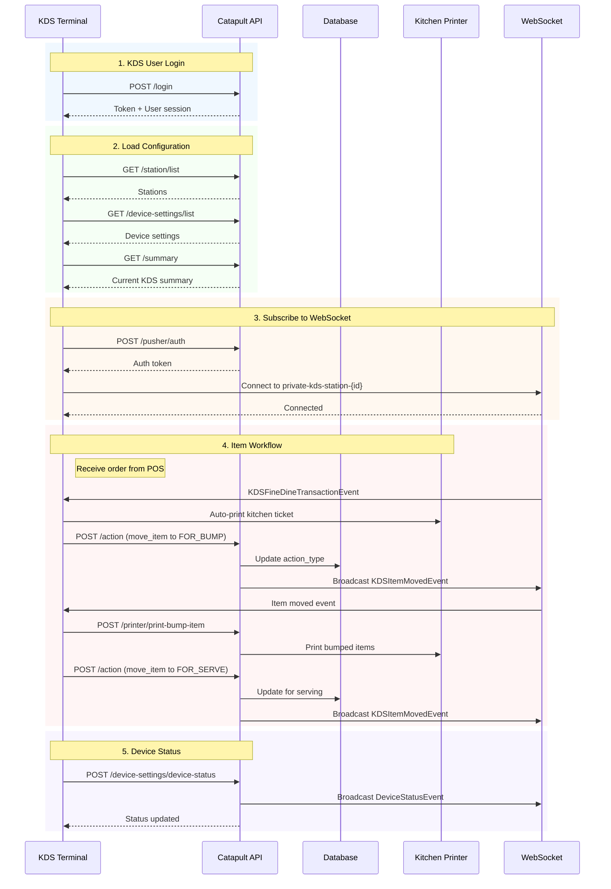

# KDS API Documentation (v1)

> **Note:** This documentation includes Mermaid sequence diagrams. If diagrams do not render properly in your editor, ensure you have Mermaid support enabled. For GitHub, GitLab, or online viewers, diagrams should render automatically. You can also use [Mermaid Live Editor](https://mermaid.live) to preview diagrams.

## Overview

The KDS (Kitchen Display System) API provides endpoints for kitchen station management, order tracking, item movement/workflow, printer control, device management, and real-time status monitoring. All endpoints are prefixed with `/api/kds/v1`.

## Base URL

```
{HOST}/api/kds/v1
```

## Authentication

### Auth Flow (KDS)



### Middleware: `kds-token`

All authenticated endpoints use the `kds-token` middleware which:

1. Extracts JWT from `Authorization: Bearer <token>` header
2. Validates the `kds` scope in JWT claims
3. Checks token exists in `oauth_access_tokens` table
4. Validates token expiration and user branch access

### Headers

| Header | Value | Required |
|--------|-------|----------|
| `Authorization` | `Bearer <token>` | Yes (authenticated routes) |
| `Content-Type` | `application/json` | Yes |
| `Accept` | `application/json` | Yes |

---

## Standard Response Format

### Success Response

```json
{
  "success": true,
  "data": { ... },
  "message": "Operation message",
  "errors": [],
  "alert": false
}
```

### Error Response

```json
{
  "success": false,
  "data": [],
  "message": "Error description",
  "errors": ["error detail"],
  "alert": false
}
```

### Auth Response (Login/Logout)

```json
{
  "success": true,
  "data": { ... },
  "message": "Token Generated",
  "errors": [],
  "tokenResponseCode": "<TOKEN_GENERATED>"
}
```

---

## Endpoints

### 1. Authentication

#### POST `/login`

Authenticate a KDS user with passcode or credentials.

**Supports two auth types:**

| Auth Type | Description |
|-----------|-------------|
| `passcode` | Passcode-based authentication (primary method) |
| `user` | User credential authentication (username/password) |

**Request Body (Passcode Auth):**

```json
{
  "passcode": "1234"
}
```

**Request Body (User Auth):**

```json
{
  "username": "kitchen_user",
  "password": "secret"
}
```

> **NOTES — CDIS Authentication**
>
> Due to recent changes in the CDIS authentication requirements, **passcode-only validation is currently implemented as the default authentication method**.

To make the authentication flow more flexible and avoid requiring code changes when the authentication requirement changes in the future, the system can be enhanced to support a configurable authentication method.

The authentication type can be controlled through the `.env` file and exposed through `config/system.php`. The configuration should allow the application to determine which authentication method should be used:

> * **Passcode Only** — validates the user's passcode without requiring a username/password.
> * **Username & Password** — validates the user's credentials using both username and password.

For example, the `.env` file can contain a configuration value indicating the preferred authentication method, while `config/system.php` can expose this value to the application.

This approach allows the authentication method to be changed through configuration rather than modifying the authentication logic directly. It also provides a safer way to accommodate future CDIS authentication changes without affecting the existing implementation.

> **Current implementation:** Passcode-only validation.
>
> **Recommended enhancement:** Add an authentication-type configuration in `.env` and `config/system.php` to support switching between **passcode-only** and **username/password** authentication.


**Response (200 OK):**

```json
{
  "success": true,
  "data": {
    "session": {
      "accessToken": "eyJ0eXAiOi...",
      "token": {
        "id": "token-id",
        "name": "kds-terminal",
        "expires_at": "2026-08-14T00:00:00.000000Z"
      }
    },
    "user": {
      "id": 1,
      "name": "Kitchen Staff",
      "status": "ACTIVE"
    },
    "auth_type": "passcode",
    "branch_bid": "1000000000000000001",
    "allowed_branches": [
      {
        "id": 1,
        "name": "Main Branch",
        "bid": "1000000000000000001"
      }
    ]
  },
  "message": "Token Generated",
  "errors": [],
  "tokenResponseCode": "<TOKEN_GENERATED>"
}
```

**Error Responses:**

| tokenResponseCode | Description |
|-------------------|-------------|
| `<INVALID_CREDENTIALS>` | Wrong passcode/username password |
| `<USER_DEACTIVATED>` | User account is not active |
| `<INVALID_PASSCODE>` | Passcode format invalid |
| `<NO_BRANCH_ACCESS>` | User has no branch access |

---

#### POST `/logout`

Revoke all active tokens for the current KDS session.

**Request Body:** None required

**Response (200 OK):**

```json
{
  "success": true,
  "data": [],
  "message": "Successfully logged out",
  "errors": [],
  "alert": false
}
```

---

### 2. Kitchen Station Management

#### GET `/station/list`

Retrieve all kitchen stations with optional device details.



**Query Parameters:**

| Parameter | Type | Required | Description |
|-----------|------|----------|-------------|
| `filters` | JSON string | No | Filter criteria (JSON-encoded) |
| `include_device` | boolean | No | Include associated device details (default: false) |

**Example Request:**

```
GET /station/list?filters={"status":1}&include_device=true
```

**Response (200 OK):**

```json
{
  "success": true,
  "data": {
    "station": [
      {
        "bid": "1000000000000000045",
        "code": "PANTRY",
        "name": "Pantry Station",
        "index": 1,
        "status": 1,
        "device": {
          "device_uid": "KDS-PANTRY-001",
          "device_type": "kds",
          "socket_status": 1
        }
      },
      {
        "bid": "1000000000000000046",
        "code": "GRILL",
        "name": "Grill Station",
        "index": 2,
        "status": 1,
        "device": null
      }
    ]
  },
  "message": "",
  "errors": [],
  "alert": false
}
```

**Response Fields:**

| Field | Type | Description |
|-------|------|-------------|
| `station[].bid` | string | Station business identifier |
| `station[].code` | string | Station code (e.g., "PANTRY", "GRILL") |
| `station[].name` | string | Human-readable station name |
| `station[].index` | integer | Station display order |
| `station[].status` | integer | Station status (1=active, 0=inactive) |
| `station[].device` | object | Associated device details (if include_device=true) |

---

#### GET `/station/process-list`

Retrieve kitchen station process types.

**Query Parameters:**

| Parameter | Type | Required | Description |
|-----------|------|----------|-------------|
| `filters` | JSON string | No | Filter criteria (JSON-encoded) |

**Response (200 OK):**

```json
{
  "success": true,
  "data": {
    "station_process": [
      {
        "bid": "1000000000000000001",
        "code": "PREP",
        "name": "Prepare",
        "description": "Item is being prepared",
        "order": 1,
        "status": 1
      },
      {
        "bid": "1000000000000000002",
        "code": "BUMP",
        "name": "Bump",
        "description": "Item is ready for bumping",
        "order": 2,
        "status": 1
      }
    ]
  },
  "message": "",
  "errors": [],
  "alert": false
}
```

---

#### GET `/station/device`

Retrieve kitchen stations mapped to devices.



**Query Parameters:**

| Parameter | Type | Required | Description |
|-----------|------|----------|-------------|
| `filters` | JSON string | No | Filter criteria (JSON-encoded) |

**Response (200 OK):**

```json
{
  "success": true,
  "data": [
    {
      "device_uid": "KDS-PANTRY-001",
      "device_type": "kds",
      "kitchen_station_bid": "1000000000000000045",
      "kitchen_station_name": "Pantry Station",
      "socket_status": 1,
      "last_connected_at": "2026-08-14T10:30:00Z"
    }
  ],
  "message": "",
  "errors": [],
  "alert": false
}
```

---

### 3. KDS Summary & Analytics

#### GET `/summary`

Retrieve KDS summary data including order counts, legend breakdown, and active items.



**Query Parameters:**

| Parameter | Type | Required | Description |
|-----------|------|----------|-------------|
| `device_uid` | string | No | Filter by device UID (resolves to station) |
| `station_code` | string | No | Filter by kitchen station code |

**Example Request:**

```
GET /summary?device_uid=KDS-PANTRY-001
```

**Response (200 OK):**

```json
{
  "success": true,
  "data": {
    "order_summary": {
      "total_serve": {
        "transactions": 15,
        "items": 127
      },
      "serving": {
        "transactions": 8,
        "items": 34
      }
    },
    "legends": {
      "on_time_done": {
        "transactions": 12,
        "items": 105
      },
      "delay_done": {
        "transactions": 3,
        "items": 22
      },
      "on_going": {
        "transactions": 6,
        "items": 28
      },
      "on_going_delay": {
        "transactions": 2,
        "items": 6
      }
    },
    "items": [
      {
        "name": "S-CHOCOCHAMPORADO",
        "qty": 5,
        "delay": 0
      },
      {
        "name": "S-SUPERARROZCALDO",
        "qty": 4,
        "delay": 1
      }
    ]
  },
  "message": "Summary retrieved",
  "errors": [],
  "alert": false
}
```

**Response Fields:**

| Field | Type | Description |
|-------|------|-------------|
| `order_summary.total_serve` | object | Total orders served today |
| `order_summary.serving` | object | Currently serving orders |
| `legends.on_time_done` | object | Orders completed on time |
| `legends.delay_done` | object | Orders completed late |
| `legends.on_going` | object | Currently active orders on time |
| `legends.on_going_delay` | object | Currently active orders delayed |
| `items[].name` | string | Product name |
| `items[].qty` | integer | Current quantity of item |
| `items[].delay` | integer | Count of delayed items |

**Calculation Logic:**

- Orders are marked as delayed if they exceed `max_preparation_time`
- Active orders are those with `completed_at IS NULL`
- Done orders are those with `completed_at NOT NULL` and created today
- Items are sorted by quantity (descending)

---

### 4. KDS Item Movement & Workflow

#### POST `/action`

Unified endpoint for all KDS movement operations (move, done, release, etc.).



**Request Body:**

```json
{
  "action": "move_item",
  "payload": {
    "data": {
      "items": [
        {
          "kitchen_display_detail_bid": "1016000000000000086",
          "product_bid": "1000000000000000140",
          "name": "S-CHOCOCHAMPORADO",
          "quantity": 1,
          "remaining_quantity": 1
        }
      ],
      "transaction": {
        "transaction_id": "000000000007",
        "order_number": "000000000007",
        "table_number": "6",
        "terminal_bid": "1000000000000000031"
      },
      "order_type": {
        "id": 1,
        "name": "DINE IN"
      }
    },
    "next": true,
    "quantity": 1,
    "remaining_quantity": 1,
    "moved_quantity": 1,
    "release": false
  }
}
```

**Request Parameters:**

| Parameter | Type | Required | Description |
|-----------|------|----------|-------------|
| `action` | string | Yes | Action type: `move_item`, `move_order`, `bump_order` |
| `payload` | object | Yes | Action payload with data and context |
| `payload.data` | object | Yes | Items, transaction, and order type information |
| `payload.data.items` | array | Yes | Array of items to move |
| `payload.data.items[].kitchen_display_detail_bid` | string | Yes | KDS detail business ID |
| `payload.data.items[].product_bid` | string | Yes | Product business ID |
| `payload.data.items[].name` | string | Yes | Product name |
| `payload.data.items[].quantity` | integer | Yes | Item quantity |
| `payload.data.items[].remaining_quantity` | integer | Yes | Remaining quantity to process |
| `payload.data.transaction` | object | Yes | Transaction context |
| `payload.data.transaction.transaction_id` | string | Yes | Transaction identifier |
| `payload.data.order_type` | object | Yes | Order type details |
| `payload.next` | boolean | Yes | Move to next action (true) or repeat current (false) |
| `payload.quantity` | integer | Yes | Quantity being moved |
| `payload.remaining_quantity` | integer | Yes | Total remaining quantity |
| `payload.moved_quantity` | integer | Yes | Total moved so far |
| `payload.release` | boolean | No | Release items (for final release action) |

**Supported Actions:**

| Action | Description |
|--------|-------------|
| `move_item` | Move single item to next workflow stage |
| `move_order` | Move entire order to next stage |
| `bump_order` | Mark items as bumped (ready for serving) |

**Response (200 OK):**

```json
{
  "success": true,
  "data": {
    "action": "move_item",
    "updated_at": "2026-08-14T10:30:00Z",
    "items_processed": 1,
    "next_action": "move_order",
    "remaining_items": 0
  },
  "message": "Item moved successfully to next stage",
  "errors": [],
  "alert": false
}
```

**Response Fields:**

| Field | Type | Description |
|-------|------|-------------|
| `action` | string | Action that was executed |
| `updated_at` | string | Timestamp of operation |
| `items_processed` | integer | Number of items processed |
| `next_action` | string | Suggested next action |
| `remaining_items` | integer | Items remaining to process |

---

### 5. Kitchen Printer Control

#### POST `/printer/print-order`

Print full kitchen order for all items in a transaction.



**Request Body:**

```json
{
  "transaction": {
    "transaction_id": "000000000007",
    "order_number": "000000000007",
    "table_number": "6",
    "terminal_bid": "1000000000000000031",
    "date": "2026-08-14 10:30:00"
  },
  "items": [
    {
      "product_bid": "1000000000000000140",
      "name": "S-CHOCOCHAMPORADO",
      "quantity": 1,
      "special_request": "Add fresh milk"
    }
  ],
  "printer_host": "KITCHEN_PRINTER_01"
}
```

**Request Parameters:**

| Parameter | Type | Required | Description |
|-----------|------|----------|-------------|
| `transaction` | object | Yes | Transaction context for printing |
| `transaction.transaction_id` | string | Yes | Transaction identifier |
| `transaction.order_number` | string | Yes | Order number to display |
| `transaction.table_number` | string | No | Table number for dine-in |
| `transaction.terminal_bid` | string | Yes | Terminal business ID |
| `items` | array | Yes | Items to print (or empty to reconstruct from DB) |
| `items[].product_bid` | string | Yes | Product business ID |
| `items[].name` | string | Yes | Product name |
| `items[].quantity` | integer | Yes | Quantity to print |
| `items[].special_request` | string | No | Special cooking instructions |
| `printer_host` | string | No | Printer IP or Windows printer name (auto-resolved if empty) |

**Response (200 OK):**

```json
{
  "success": true,
  "data": {
    "printer_host": "KITCHEN_PRINTER_01",
    "items_printed": 1,
    "printed_at": "2026-08-14T10:30:00Z"
  },
  "message": "Order printed successfully.",
  "errors": [],
  "alert": false
}
```

**Response Fields:**

| Field | Type | Description |
|-------|------|-------------|
| `printer_host` | string | Printer that was used |
| `items_printed` | integer | Number of items printed |
| `printed_at` | string | Print timestamp |

**Error Scenarios:**

| Error | Status | Description |
|-------|--------|-------------|
| `No items found for this transaction` | 400 | Transaction has no items |
| `No printer host configured` | 400 | Cannot determine printer |
| `Printer connection failed` | 500 | Network error to printer |

---

#### POST `/printer/print-bump-item`

Print only items that have been bumped (marked as ready for serving).

**Request Body:**

```json
{
  "transaction": {
    "transaction_id": "000000000007",
    "order_number": "000000000007",
    "table_number": "6",
    "terminal_bid": "1000000000000000031"
  },
  "items": [
    {
      "product_bid": "1000000000000000140",
      "name": "S-CHOCOCHAMPORADO",
      "quantity": 1,
      "bumped_quantity": 1,
      "is_addon": false,
      "special_request": null
    }
  ],
  "printer_host": "KITCHEN_PRINTER_01"
}
```

**Request Parameters:**

| Parameter | Type | Required | Description |
|-----------|------|----------|-------------|
| `transaction` | object | Yes | Transaction context |
| `items` | array | Yes | Items with bumped_quantity > 0 |
| `items[].bumped_quantity` | integer | Yes | Quantity bumped (must be > 0) |
| `items[].is_addon` | boolean | Yes | Whether item is add-on |
| `printer_host` | string | No | Printer host (auto-resolved if empty) |

**Response (200 OK):**

```json
{
  "success": true,
  "data": {
    "printer_host": "KITCHEN_PRINTER_01",
    "items_printed": 1,
    "bumped_items": 1,
    "printed_at": "2026-08-14T10:30:00Z"
  },
  "message": "Bumped items printed successfully.",
  "errors": [],
  "alert": false
}
```

**Error Scenarios:**

| Error | Description |
|-------|-------------|
| `No bumped items found (bumped_quantity > 0 required)` | No items have bumped_quantity > 0 |
| `No printer host configured` | Cannot determine printer |

---

#### POST `/printer/print-table-number`

Print only the table number in large, centered text.

**Request Body:**

```json
{
  "transaction": {
    "table_number": "Table 6",
    "order_number": "000000000007",
    "transaction_id": "000000000007"
  },
  "printer_host": "KITCHEN_PRINTER_01"
}
```

**Request Parameters:**

| Parameter | Type | Required | Description |
|-----------|------|----------|-------------|
| `transaction` | object | Yes | Transaction context |
| `transaction.table_number` | string | Yes | Table number to print |
| `transaction.order_number` | string | Yes | Order reference |
| `printer_host` | string | No | Printer host (uses PRINTER_KITCHEN env if empty) |

**Response (200 OK):**

```json
{
  "success": true,
  "data": {
    "printer_host": "KITCHEN_PRINTER_01",
    "table_number": "Table 6",
    "printed_at": "2026-08-14T10:30:00Z"
  },
  "message": "Table number printed successfully.",
  "errors": [],
  "alert": false
}
```

---

### 6. Device Settings & Configuration

#### GET `/device-settings/list`

Retrieve all registered KDS device settings.



**Response (200 OK):**

```json
{
  "success": true,
  "data": [
    {
      "id": 1,
      "device_uid": "KDS-PANTRY-001",
      "device_type": "kds",
      "socket_status": 1,
      "last_connected_at": "2026-08-14T10:30:00Z",
      "print_status": 1,
      "kitchen_station_bid": "1000000000000000045",
      "kitchen_station_name": "Pantry Station"
    },
    {
      "id": 2,
      "device_uid": "KDS-GRILL-001",
      "device_type": "kds",
      "socket_status": 0,
      "last_connected_at": "2026-08-14T09:15:00Z",
      "print_status": 1,
      "kitchen_station_bid": "1000000000000000046",
      "kitchen_station_name": "Grill Station"
    }
  ],
  "message": "",
  "errors": [],
  "alert": false
}
```

**Response Fields:**

| Field | Type | Description |
|-------|------|-------------|
| `device_uid` | string | Unique device identifier |
| `device_type` | string | Device type (e.g., "kds") |
| `socket_status` | integer | Socket connection status (1=online, 0=offline) |
| `last_connected_at` | string | Last connection timestamp |
| `print_status` | integer | Printer status (1=working, 0=offline) |
| `kitchen_station_bid` | string | Assigned kitchen station BID |

**Note:** Devices are automatically marked offline if `last_connected_at` is more than 5 minutes ago.

---

#### POST `/device-settings/update`

Update device settings.

**Request Body:**

```json
{
  "device_uid": "KDS-PANTRY-001",
  "kitchen_station_bid": "1000000000000000045",
  "print_status": 1,
  "status": 1
}
```

**Request Parameters:**

| Parameter | Type | Required | Description |
|-----------|------|----------|-------------|
| `device_uid` | string | Yes | Unique device identifier |
| `kitchen_station_bid` | string | No | Assign to kitchen station |
| `print_status` | integer | No | Printer status (1=working, 0=offline) |
| `status` | integer | No | Device status (1=active, 0=inactive) |

**Response (200 OK):**

```json
{
  "success": true,
  "data": {
    "id": 1,
    "device_uid": "KDS-PANTRY-001",
    "kitchen_station_bid": "1000000000000000045",
    "socket_status": 1,
    "print_status": 1,
    "updated_at": "2026-08-14T10:30:00Z"
  },
  "message": "Device updated successfully!",
  "errors": [],
  "alert": false
}
```

---

#### POST `/device-settings/device-status`

Update and broadcast device connection status.



**Request Body:**

```json
{
  "device_uid": "KDS-PANTRY-001",
  "socket_status": 1
}
```

**Request Parameters:**

| Parameter | Type | Required | Description |
|-----------|------|----------|-------------|
| `device_uid` | string | Yes | Device identifier |
| `socket_status` | integer | Yes | Connection status (1=online, 0=offline) |

**Response (200 OK):**

```json
{
  "success": true,
  "data": {
    "device_uid": "KDS-PANTRY-001",
    "socket_status": 1,
    "last_connected_at": "2026-08-14T10:30:00Z"
  },
  "message": "Device status broadcasted successfully!",
  "errors": [],
  "alert": false
}
```

---

#### POST `/device-settings/print-status`

Update and broadcast device printer status.

**Request Body:**

```json
{
  "device_uid": "KDS-PANTRY-001",
  "print_status": 1
}
```

**Request Parameters:**

| Parameter | Type | Required | Description |
|-----------|------|----------|-------------|
| `device_uid` | string | Yes | Device identifier |
| `print_status` | integer | Yes | Printer status (1=working, 0=offline) |

**Response (200 OK):**

```json
{
  "success": true,
  "data": {
    "device_uid": "KDS-PANTRY-001",
    "print_status": 1,
    "updated_at": "2026-08-14T10:30:00Z"
  },
  "message": "Print status broadcasted successfully!",
  "errors": [],
  "alert": false
}
```

---

#### GET `/device-settings/config`

Retrieve device configuration and server information.

**Response (200 OK):**

```json
{
  "success": true,
  "data": {
    "key": "your-pusher-key",
    "cluster": "mt1",
    "port": 6001,
    "host": "127.0.0.1",
    "scheme": "http",
    "ip": "192.168.1.100",
    "client_ip": "192.168.1.100",
    "server_ip": "192.168.1.50"
  },
  "message": "Device config retrieved successfully!",
  "errors": [],
  "alert": false
}
```

**Response Fields:**

| Field | Type | Description |
|-------|------|-------------|
| `key` | string | Pusher/WebSocket API key |
| `cluster` | string | Pusher cluster |
| `port` | integer | WebSocket server port |
| `host` | string | WebSocket server host |
| `scheme` | string | Connection scheme (http/https) |
| `ip` | string | Client IP address |
| `client_ip` | string | Client IP from request |
| `server_ip` | string | Server IP address |

---

### 7. WebSocket Authentication

#### POST `/pusher/auth`

Authenticate WebSocket channel subscription via Pusher.



**Request Headers:**

| Header | Value | Required |
|--------|-------|----------|
| `x-app-key` | Pusher app key | Yes |
| `Content-Type` | `application/json` | Yes |

**Request Body:**

```json
{
  "socket_id": "12345.67890",
  "channel_name": "private-kds-pantry-1"
}
```

**Request Parameters:**

| Parameter | Type | Required | Description |
|-----------|------|----------|-------------|
| `socket_id` | string | Yes | WebSocket client socket ID |
| `channel_name` | string | Yes | Channel to subscribe to |

**Response (200 OK):**

```json
{
  "auth": "key:signature",
  "channel_data": "{\"user_id\":\"user-123\"}"
}
```

**Channel Naming Conventions:**

| Channel Pattern | Purpose |
|-----------------|---------|
| `private-kds-station-{station_bid}` | Station-specific updates |
| `private-kds-device-{device_uid}` | Device status updates |
| `private-kds-order-{transaction_id}` | Order-specific updates |
| `presence-kds-{branch_bid}` | Branch-wide presence |

---

## WebSocket Events

The KDS API triggers the following broadcast events via Pusher:

| Event | Channel | Triggered By | Payload |
|-------|---------|-------------|---------|
| `KDSItemMovedEvent` | `private-kds-station-*` | `/action` (move_item) | Item details, new action_type |
| `KDSOrderMovedEvent` | `private-kds-station-*` | `/action` (move_order) | All order items, new status |
| `KDSBumpOrderEvent` | `private-kds-station-*` | `/action` (bump_order) | Bumped items, quantities |
| `DeviceStatusEvent` | `private-kds-device-*` | `/device-settings/device-status` | Device UID, socket_status |
| `PrintStatusEvent` | `private-kds-device-*` | `/device-settings/print-status` | Device UID, print_status |
| `KDSSummaryUpdatedEvent` | `presence-kds-*` | Item movement | Updated summary counts |

---

## Complete Workflow Example: Fine Dine Order



---

## Common Error Responses

| HTTP Status | Scenario | Response |
|-------------|----------|----------|
| 200 | Success (check `success` field) | Standard success format |
| 400 | Bad request (validation failure) | `{ "success": false, "errors": [...] }` |
| 401 | Missing or invalid token | `{ "success": false, "message": "Unauthenticated" }` |
| 403 | Insufficient permissions | `{ "success": false, "message": "Unauthorized" }` |
| 422 | Validation error | `{ "success": false, "errors": ["field": ["error message"]] }` |
| 500 | Internal server error | `{ "success": false, "message": "Internal Server Error" }` |

---

## Route Summary

| Method | Endpoint | Auth | Description |
|--------|----------|------|-------------|
| POST | `/login` | No | Authenticate KDS user |
| POST | `/logout` | Yes | Revoke session tokens |
| GET | `/station/list` | Yes | List kitchen stations |
| GET | `/station/process-list` | Yes | List station processes |
| GET | `/station/device` | Yes | List device-station mappings |
| GET | `/summary` | Yes | Get KDS summary data |
| POST | `/action` | Yes | Execute KDS item movement |
| POST | `/printer/print-order` | Yes | Print full kitchen order |
| POST | `/printer/print-bump-item` | Yes | Print bumped items |
| POST | `/printer/print-table-number` | Yes | Print table number |
| GET | `/device-settings/list` | Yes | List all devices |
| POST | `/device-settings/update` | Yes | Update device settings |
| POST | `/device-settings/device-status` | Yes | Update device connection status |
| POST | `/device-settings/print-status` | Yes | Update printer status |
| GET | `/device-settings/config` | Yes | Get device configuration |
| POST | `/pusher/auth` | No | Authenticate WebSocket channel |
