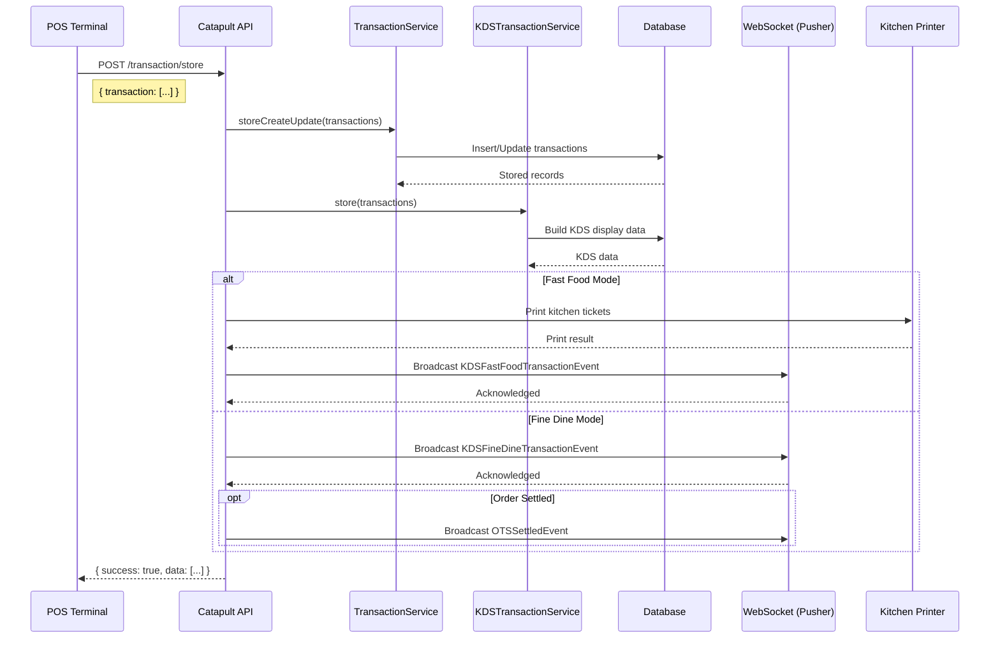

# POS API Documentation (v1)

## Overview

The POS (Point of Sale) API provides endpoints for terminal authentication, transaction management, item availability, table/location management, device settings, and receipt printing. All endpoints are prefixed with `/api/pos/v1`.

## Scope & Coverage

> **Note:** This API documentation is specifically focused on the **TMG POS integration** use case. It covers endpoints for submitting transaction data from POS terminals to the Catapult server for processing and display on Kitchen Display Systems (KDS). This documentation includes transactions only. Additional endpoints and features available in the full Catapult API are not included in this documentation. For a complete API reference, please contact the Bonfire team.

## Base URL

```
{HOST}/api/pos/v1
```

## Authentication

### Auth Flow

For TMG POS integration, authentication is simplified using application credentials:

**Simple Authentication Method:**
- All API requests require `app_id` and `app_key` in the request body
- No middleware implementation required on the POS side
- Eliminates complexity of token management and OAuth flow
- Simplifies integration and makes it easier to maintain

**Implementation:**
1. Include `app_id` (e.g., "tmg-pos") in request body
2. Include `app_key` (e.g., "Y2Rpcy0xMTEy") in request body
3. Include `Content-Type: application/json` header
4. Server validates credentials and processes request
5. No token generation or bearer token management needed

### Headers

| Header | Value | Required |
|--------|-------|----------|
| `Content-Type` | `application/json` | Yes |
| `Accept` | `application/json` | Yes |

---

## Standard Response Format

**Response Structure:**

All API responses follow a standardized JSON format. The following table describes each property:

| Property | Type | Description |
|----------|------|-------------|
| `success` | boolean | Indicates whether the operation was successful |
| `data` | array\|object | Response payload. Can be either an array (for list operations) or an object (for single resource operations). Empty array `[]` or `null` if no data is returned. |
| `message` | string | Human-readable message describing the operation result |
| `errors` | array | Array of error messages (empty if successful) |
| `alert` | boolean | Alert flag for client-side notification |

### Success Response

```json
{
  "success": true,
  "data": { },
  "message": "Operation message",
  "errors": [],
  "alert": false
}
```

**Note:** The `data` property can be:
- **Object** `{}` for single resource responses (e.g., transaction details)
- **Array** `[...]` for list operations (e.g., device list)
- **Null** `null` for operations with no data to return

### Error Response

```json
{
  "success": false,
  "data": [],
  "message": "Error description",
  "errors": ["error detail"],
  "alert": false
}
```

---

## Endpoints

### 1. Transactions

#### POST `/transaction/store`

Store new terminal transactions. This is the primary endpoint for submitting orders from the POS terminal to the KDS system.



**Request Body:**

```json
{
  "app_id": "tmg-pos",
  "app_key": "Y2Rpcy0xMTEy",
  "transaction": [
    {
      "date": "2026-07-30 16:29:21",
      "amount": 0,
      "transaction_id": "000000000007",
      "transaction_type": 13,
      "device_type": "POS",
      "device_mode": 2,
      "device_mode_label": "Fine Dine",
      "is_zread": 0,
      "status": 1,
      "type": 1,
      "gross": 0,
      "total_quantity": 45,
      "total_free_items_amount": 0,
      "total_local_tax_amount": 0,
      "total_tax_amount": 0,
      "total_discount_amount": 0,
      "total_vat_exempt_amount": 0,
      "total_vat_deduct_amount": 0,
      "total_vatable_sales": 0,
      "total_zero_rated_sales": 0,
      "log_date": "2026-07-30",
      "order_number": "000000000007",
      "table_id": null,// -1,
      "table_number": "6",
      "guest_count": "5",
      "index": 0,
      "official_receipt": [
        {
          "split_number": 1,
          "number": 0,
          "total": 0,
          "discount_amount": 0,
          "free_items_amount": 0,
          "vat_deduct_amount": 0,
          "vat_exempt_amount": 0,
          "original_amount": 0,
          "quantity": 45,
          "local_tax_amount": 0,
          "tax_amount": 0,
          "service_charge": 0,
          "vatable_sales": 0,
          "zero_rated_sales": 0,
          "eligible_amount_to_earn_points": 0,
          "total_tender": 0,
          "loyalty_points_detail": [],
          "gift_with_purchase_detail": [],
          "index": 0,
          "payment_method": [
              {
                  "title": "CASH",
                  "total": 280,
                  "account_number": null,
                  "index": 0,
                  "transaction_detail_bid": null,
                  "bid": null,
                  "created_at": "2025-03-18 10:41:50",
                  "updated_at": "2025-03-18 10:41:50",
                  "deleted_at": null
              }
          ],
          "si_reset_number": 0,
          "service_charge_percentage": 0,
          "manual_receipt": null,
          "product": [
            {
              "id": "1000000000000000140",
              "menu_code": "MNM0000001",
              "name": "S-CHOCOCHAMPORADO",
              "description": "S-CHOCOCHAMPORADO",
              "long_description": "S-CHOCOCHAMPORADO",
              "quantity": 1,
              "tax_percentage": 12,
              "is_free": 0,
              "is_vatable": 1,
              "original_price": 0,
              "price": 0,
              "total_addon": 0,
              "total_amount": 0,
              "amount_discount": 0,
              "vatable_sales": 0,
              "zero_rated_sales": 0,
              "tax": 0,
              "vat_exempt": 0,
              "vat_deduct": 0,
              "split_number": 1,
              "price_override_details": null,
              "entire_discount": 0,
              "supervisor_bid": null,
              "supervisor_name": null,
              "index": 0,
              "transaction_detail_bid": null,
              "product_bid": "1000000000000000140",
              "category_bid": null,
              "category_name": null,
              "order_type_id": 1,
              "order_type_name": "DINE IN",
              "is_additional": 0,
              "created_at": "2026-07-30 16:29:21",
              "updated_at": "2026-07-30 16:29:21",
              "deleted_at": null,
              "discount": [],
              "is_modified": false,
              "addon": [],
              "special_request": "Add fresh milk"
            }
          ],
          "transaction_head_bid": null,
          "or_number": 0,
          "customer_type": 0,
          "customer_bid": "0",
          "customer_name": null,
          "customer_address": null,
          "cashier_bid": "1",
          "cashier_name": "bonfire-administrator",
          "bid": null,
          "clerk_bid": "-1",
          "clerk_name": null,
          "created_at": "2026-07-30 16:29:21",
          "updated_at": "2026-07-30 16:29:21",
          "deleted_at": null
        }
      ],
      "terminal_bid": "1000000000000000031",
      "bid": null,
      "created_by": "1",
      "updated_by": null,
      "created_at": "2026-07-30 16:29:21",
      "updated_at": "2026-07-30 16:29:21",
      "deleted_at": null
    }
  ]
}
```

**Request Parameters:**

> **Note on Default Column:** All parameters marked with `-` in the Default column are **required** and must be provided. These values are essential for KDS processing and display functionality.

| Parameter | Type | Required | Default | Description |
|-----------|------|----------|---------|-------------|
| `app_id` | string | Yes | tmg-pos | Application identifier (e.g., "tmg-pos") |
| `app_key` | string | Yes | Y2Rpcy0xMTEy | Application API key for authentication |
| `transaction` | array | Yes | - | Array of transaction objects to be stored |
| `transaction[].date` | string (datetime) | Yes | - | Transaction date and time (format: YYYY-MM-DD HH:MM:SS) |
| `transaction[].amount` | numeric | Yes | - | Total transaction amount |
| `transaction[].transaction_id` | string | Yes | - | Unique transaction identifier |
| `transaction[].transaction_type` | integer | Yes | - | Transaction type. Valid values: `0`=SALES, `1`=REFUND, `2`=TRANSACTION_VOID, `3`=ITEM_VOID, `4`=UNSETTLED, `5`=READING, `6`=FREE_ITEMS, `7`=NO_SALE |
| `transaction[].device_type` | string | Yes | POS | Device type (e.g., "POS") |
| `transaction[].device_mode` | integer | Yes | 2 | Device mode: `1`=FAST_FOOD, `2`=FINE_DINE, `3`=STATION_OTS |
| `transaction[].device_mode_label` | string | Yes | Fine Dine | Human-readable device mode label |
| `transaction[].is_zread` | integer | Yes | 0 | Z-read flag (0 or 1) |
| `transaction[].status` | integer | Yes | 1 | Transaction status code |
| `transaction[].type` | integer | Yes | 1 | Transaction type code |
| `transaction[].gross` | numeric | Yes | 0 | Gross amount before tax/discounts |
| `transaction[].total_quantity` | integer | Yes | - | Total quantity of items in transaction |
| `transaction[].total_free_items_amount` | numeric | Yes | 0 | Total amount of free items |
| `transaction[].total_local_tax_amount` | numeric | Yes | 0 | Total local tax amount |
| `transaction[].total_tax_amount` | numeric | Yes | 0 | Total tax amount |
| `transaction[].total_discount_amount` | numeric | Yes | 0 | Total discount amount |
| `transaction[].total_vat_exempt_amount` | numeric | Yes | 0 | Total VAT exempt amount |
| `transaction[].total_vat_deduct_amount` | numeric | Yes | 0 | Total VAT deductible amount |
| `transaction[].total_vatable_sales` | numeric | Yes | 0 | Total vatable sales |
| `transaction[].total_zero_rated_sales` | numeric | Yes | 0 | Total zero-rated sales |
| `transaction[].log_date` | string (date) | Yes | - | Log date (format: YYYY-MM-DD) |
| `transaction[].order_number` | string | Yes | - | Order number identifier |
| `transaction[].table_id` | integer | Yes | -1 | Table identifier (`-1` or `null` if not applicable) |
| `transaction[].table_number` | string | Yes | - | Table number for dine-in orders |
| `transaction[].guest_count` | string | Yes | - | Number of guests at table |
| `transaction[].index` | integer | Yes | - | Index position in transaction array |
| `transaction[].official_receipt` | array | Yes | - | Array of official receipt records |
| `transaction[].official_receipt[].split_number` | integer | Yes | 1 | Receipt split number (default is 1 for single receipt) |
| `transaction[].official_receipt[].product` | array | Yes | - | Array of product items in receipt |
| `transaction[].official_receipt[].product[].name` | string | Yes | - | Product name |
| `transaction[].official_receipt[].product[].quantity` | integer | Yes | - | Quantity of product |
| `transaction[].official_receipt[].product[].price` | numeric | Yes | - | Unit price of product |
| `transaction[].official_receipt[].product[].order_type_id` | integer | Yes | - | Order type ID. Valid values: `1`=DINE_IN, `2`=TAKE_OUT, `3`=DELIVERY, `4`=DRIVE_THRU |
| `transaction[].official_receipt[].product[].order_type_name` | string | Yes | - | Order type name. Valid values: `"DINE IN"` (id:1), `"TAKE OUT"` (id:2), `"DELIVERY"` (id:3), `"DRIVE THRU"` (id:4). Note: Additional order types require discussion and coordination across all systems. |
| `transaction[].official_receipt[].product[].is_additional` | integer | Yes | 0 | Flag if the item is additional (`0` = existing or `1` = new) |
| `transaction[].official_receipt[].product[].special_request` | string | No | null | Special instructions for product |
| `transaction[].official_receipt[].number` | integer | No | 0 | Receipt number |
| `transaction[].official_receipt[].total` | numeric | Yes | - | Receipt total amount |
| `transaction[].official_receipt[].discount_amount` | numeric | Yes | 0 | Total discount amount for receipt |
| `transaction[].official_receipt[].free_items_amount` | numeric | Yes | 0 | Total free items amount |
| `transaction[].official_receipt[].vat_deduct_amount` | numeric | Yes | 0 | Total VAT deductible amount |
| `transaction[].official_receipt[].vat_exempt_amount` | numeric | Yes | 0 | Total VAT exempt amount |
| `transaction[].official_receipt[].original_amount` | numeric | Yes | 0 | Original amount before discounts |
| `transaction[].official_receipt[].quantity` | integer | Yes | - | Total quantity of items in receipt |
| `transaction[].official_receipt[].local_tax_amount` | numeric | Yes | 0 | Total local tax amount |
| `transaction[].official_receipt[].tax_amount` | numeric | Yes | 0 | Total tax amount |
| `transaction[].official_receipt[].service_charge` | numeric | Yes | 0 | Service charge amount |
| `transaction[].official_receipt[].vatable_sales` | numeric | Yes | 0 | Total vatable sales |
| `transaction[].official_receipt[].zero_rated_sales` | numeric | Yes | 0 | Total zero-rated sales |
| `transaction[].official_receipt[].eligible_amount_to_earn_points` | numeric | Yes | 0 | Amount eligible to earn loyalty points |
| `transaction[].official_receipt[].total_tender` | numeric | Yes | 0 | Total tender amount |
| `transaction[].official_receipt[].loyalty_points_detail` | array | No | [] | Loyalty points breakdown |
| `transaction[].official_receipt[].gift_with_purchase_detail` | array | No | [] | Gift with purchase details |
| `transaction[].official_receipt[].payment_method` | array | No | [] | Array of payment methods (empty if transaction not settled; populated when settlement occurs) |
| `transaction[].official_receipt[].si_reset_number` | integer | No | 0 | SI (Sales Invoice) reset number |
| `transaction[].official_receipt[].service_charge_percentage` | numeric | Yes | 0 | Service charge percentage |
| `transaction[].official_receipt[].manual_receipt` | string\|null | No | null | Manual receipt reference if applicable |
| `transaction[].official_receipt[].transaction_head_bid` | string | No | null | Transaction head BID |
| `transaction[].official_receipt[].or_number` | integer | No | 0 | Official Receipt (OR) number |
| `transaction[].official_receipt[].customer_type` | integer | No | 0 | Customer type code |
| `transaction[].official_receipt[].customer_bid` | string | No | null | Customer business ID |
| `transaction[].official_receipt[].customer_name` | string | No | null | Customer name |
| `transaction[].official_receipt[].customer_address` | string | No | null | Customer address |
| `transaction[].official_receipt[].cashier_bid` | string | Yes | - | Cashier business ID (will be displayed as server/station name on the KDS) |
| `transaction[].official_receipt[].cashier_name` | string | Yes | - | Cashier name (will be displayed as server/station name on the KDS) |
| `transaction[].official_receipt[].bid` | string | No | null | Receipt business ID |
| `transaction[].official_receipt[].clerk_bid` | string | No | null | Clerk business ID |
| `transaction[].official_receipt[].clerk_name` | string | No | null | Clerk name |
| `transaction[].official_receipt[].created_at` | string | No | null | Receipt creation timestamp |
| `transaction[].official_receipt[].updated_at` | string | No | null | Receipt update timestamp |
| `transaction[].official_receipt[].deleted_at` | string | No | null | Receipt deletion timestamp (soft delete) |
| `transaction[].terminal_bid` | string | Yes | - | Unique terminal identifier for the branch. If the branch supports multiple POS terminals, this identifier distinguishes which terminal submitted the transaction. **Note:** Implementation approach for supporting multiple terminals on the current branch server needs to be discussed and coordinated. |
| `transaction[].bid` | string | No | null | Transaction business ID |
| `transaction[].created_by` | string | No | null | User ID who created the transaction |
| `transaction[].updated_by` | string | No | null | User ID who updated the transaction |
| `transaction[].created_at` | string | No | null | Transaction creation timestamp |
| `transaction[].updated_at` | string | No | null | Transaction update timestamp |
| `transaction[].deleted_at` | string | No | null | Transaction deletion timestamp (soft delete) |

**Response (200 OK):**

```json
{
  "success": true,
  "data": null,
  "message": "Terminal Transaction successfully created.",
  "errors": [],
  "tokenResponseCode": false
}
```

**Response Fields:**

| Field | Type | Description |
|-------|------|-------------|
| `success` | boolean | Indicates successful operation |
| `data` | object | Response data containing transaction details |
| `message` | string | Operation success message |
| `errors` | array | Array of error messages (empty if successful) |
| `tokenResponseCode` | boolean/string | Token response code |

**Important Notes & Highlights:**

**Settled Transactions:** 
When submitting a settled transaction (final payment received), continue using the `/transaction/store` API endpoint. The `payment_method` array within the official receipt is used to record how payment was received. 

**Important:** 
- **If transaction is NOT settled yet** (no payment received): `payment_method` should be an **empty array `[]`** to send the order to KDS immediately for preparation.
- **If transaction IS settled** (payment received): Include the `payment_method` array with payment details, which will also be sent to KDS.

Payment method structure:

 | Field | Type | Description |
 |-------|------|-------------|
 | `title` | string | Payment method type (e.g., "CASH", "CARD", "CHECK") |
 | `total` | numeric | Amount paid via this method |
 | `account_number` | string\|null | Account/card number (if applicable) |
 | `index` | integer | Sequential index of payment method |

 **Example (Settled - with payment):**
 ```json
 "payment_method": [
   {
     "title": "CASH",
     "total": 720,
     "account_number": null,
     "index": 0
   },
   {
     "title": "CARD",
     "total": 280,
     "account_number": "1234",
     "index": 1
   }
 ]
 ```

 **Example (Not settled - no payment yet):**
 ```json
 "payment_method": []
 ```

 **Additional Items on Existing Order:** 
 To add items to an existing order, submit a new transaction via `/transaction/store` with the same `transaction_id` but include all products (existing + new) in the `transaction[].official_receipt[].product` array. The system will validate the `created_at` timestamp to ensure order consistency and prevent duplicate entries. Each product object must have a valid `created_at` timestamp.
 
 **Important:** Both existing products and newly added items will appear in the product list. Use the `is_additional` flag (`0` = existing, `1` = new) to distinguish between them. The API request header structure remains the same regardless of whether you are adding new items or modifying existing order data.

**Validation:**
- `transaction` must not be empty
- Each transaction's `terminal_bid` must correspond to an existing `Terminal` database table (needs to be discussed and coordinated.)
- `app_id` and `app_key` must be valid credentials
- `date` and `log_date` formats must be valid datetime/date strings
- `transaction_type` must be one of the pre-defined constants
- `device_mode` must be one of the pre-defined constants: 1 (Fast Food), 2 (Fine Dine), or 3 (Station OTS)
- `order_type_id` and `order_type_name` must be one of the pre-defined order type pairs (see Reference Definitions)

---


#### POST `/table`

Create or update table records. Requires valid `app_key`.

**Request Body:**

```json
{
  "app_id": "tmg-pos",
  "app_key": "Y2Rpcy0xMTEy",
  "data": [
    {
      "id": 0,
      "location_id": 1,
      "table_ref": "T01",
      "seat_number": 4,
      "status": 1,
      "is_available": 1,
      "position_x": 100.0,
      "position_y": 200.0,
      "width": 50.0,
      "height": 50.0,
      "angle": 0.0
    }
  ]
}
```

**Validation Rules:**

| Parameter | Type | Required | Default | Description |
|-----------|------|----------|---------|-------------|
| `id` | integer | Yes | 0 | Table ID. Use `0` to create a new table, or provide existing ID to update |
| `location_id` | integer | Yes | - | Location ID. If table does not jave location set as `0` |
| `table_ref` | string | Yes | - | Table reference/name. Maximum 255 characters |
| `seat_number` | integer | Yes | - | Number of seats |
| `status` | integer | Yes | - | Table status (`0` = INACTIVE, `1` = ACTIVE) |
| `is_available` | integer | Yes | - | Availability flag. `0` = unavailable, `1` = available |
| `position_x` | numeric | No | null | X-axis position for table layout (nullable) |
| `position_y` | numeric | No | null | Y-axis position for table layout (nullable) |
| `width` | numeric | No | null | Table width dimension (nullable) |
| `height` | numeric | No | null | Table height dimension (nullable) |
| `angle` | numeric | No | null | Table rotation angle in degrees (nullable) |

**Response (200 OK):**

```json
{
  "success": true,
  "data": [ ... ],
  "message": "Tables saved successfully",
  "errors": [],
  "alert": false
}
```


## Error Codes

### tokenResponseCode

**Type:** `boolean|string`

The `tokenResponseCode` field in authentication responses can be either a boolean (`false` for non-auth requests) or a string code. When a string is returned, refer to the Token Response Codes table below for the code definition and its expected value.


### HTTP Status Codes

| HTTP Status | Scenario |
|-------------|----------|
| 200 | Success (check `success` field in body) |
| 401 | Missing or invalid token |
| 403 | Token scope mismatch |
| 422 | Validation error |
| 500 | Internal server error |

### Token Response Codes

Token-specific error codes returned in `tokenResponseCode`:

| Code | Expected Value | Description |
|------|---|-------------|
| `<TOKEN_GENERATED>` | `200-02` | Login successful |
| `<TOKEN_VALID>` | `200-01` | Token is valid |
| `<INVALID_CREDENTIALS>` | - | Bad username/password |
| `<USER_DEACTIVATED>` | - | Account disabled |
| `<DEVICE_NOT_FOUND>` | - | Unregistered device |
| `<TOKEN_REQUIRED>` | `406-04` | No authorization header |
| `<INVALID_TOKEN>` | `406-01` | Token not found in DB |
| `<EXPIRED_TOKEN>` | `406-02` | Token has expired |
| `<MALFORMED_TOKEN>` | `406-03` | JWT parse failure |
| `<TOKEN_ERROR>` | `406-05` | General token error |
