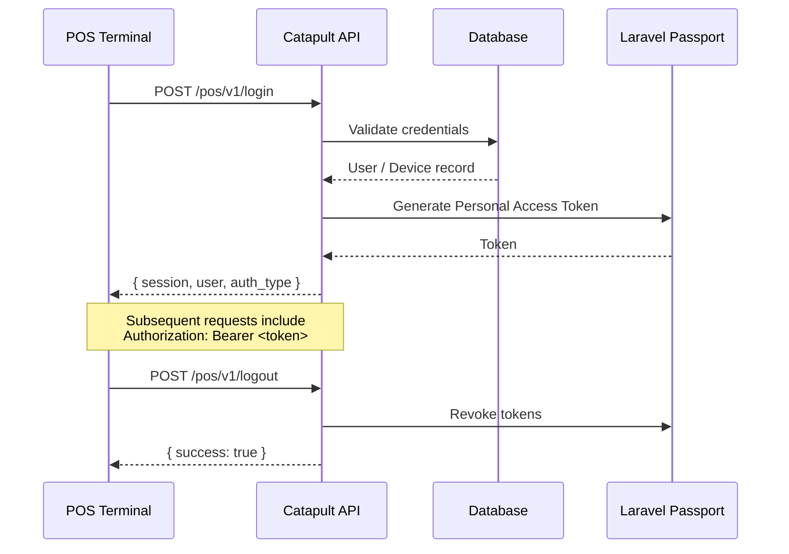
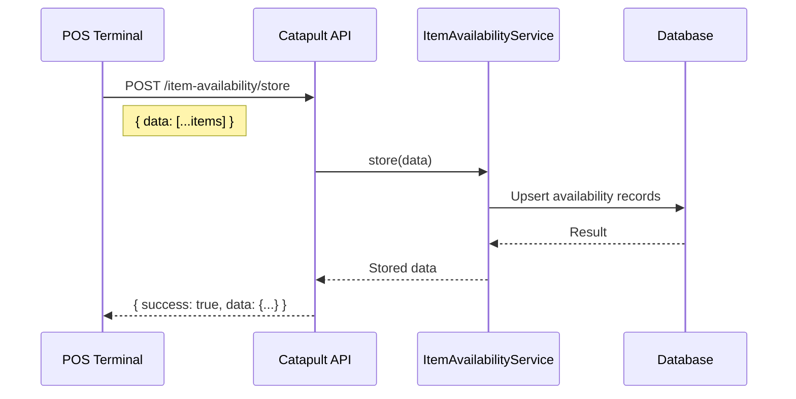
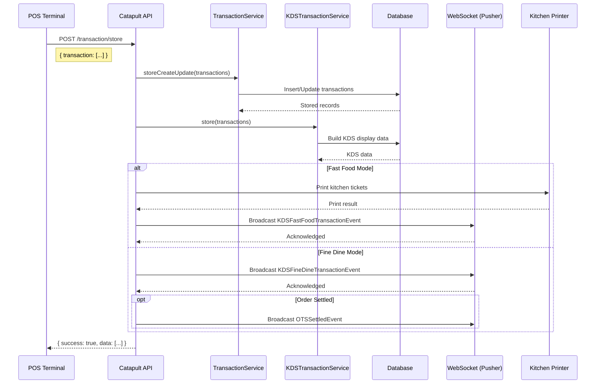
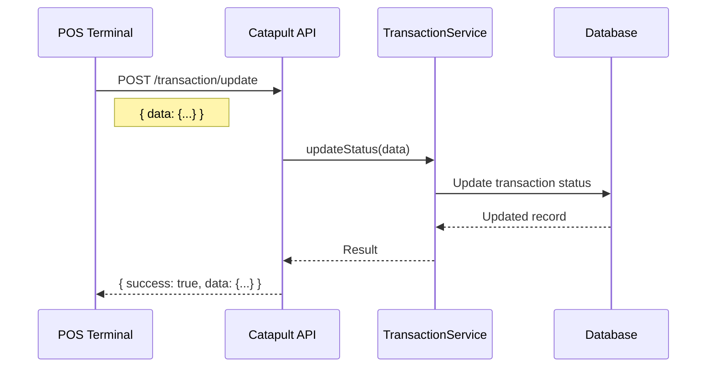
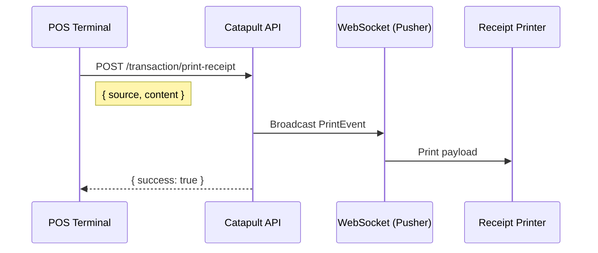
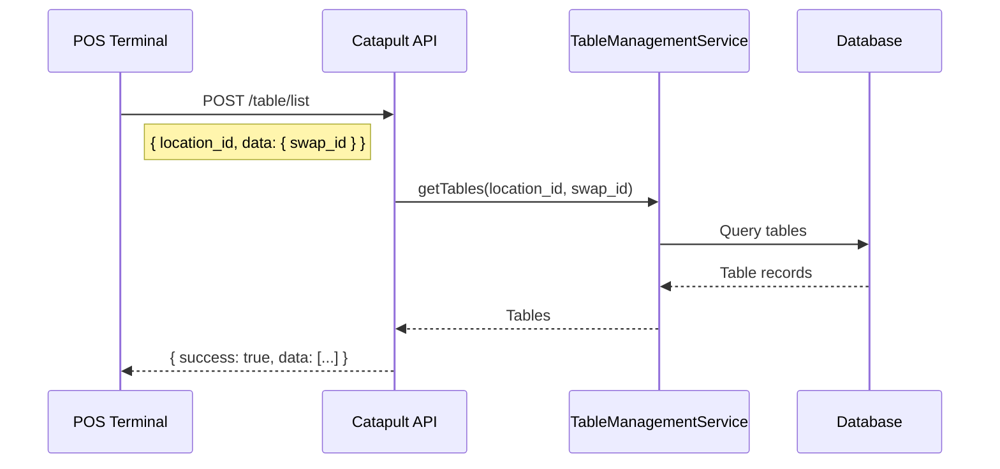
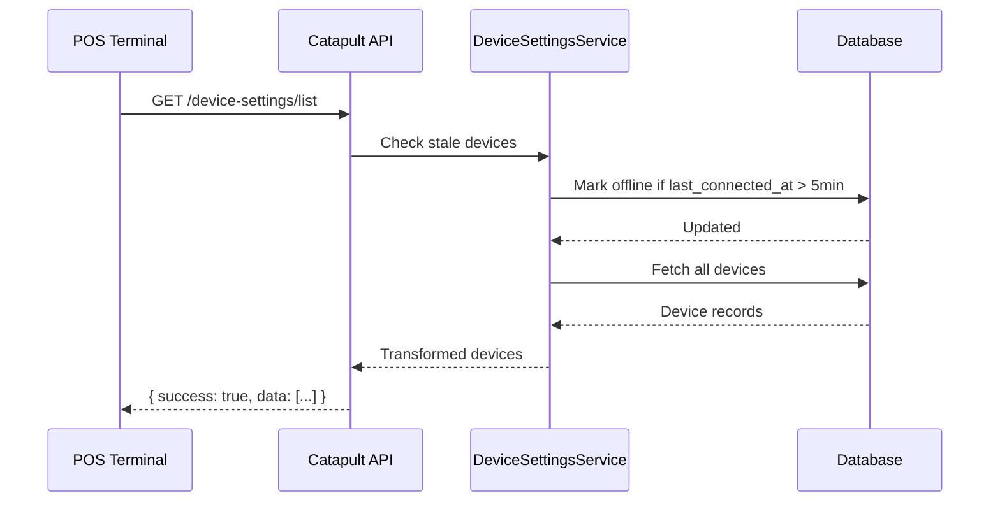
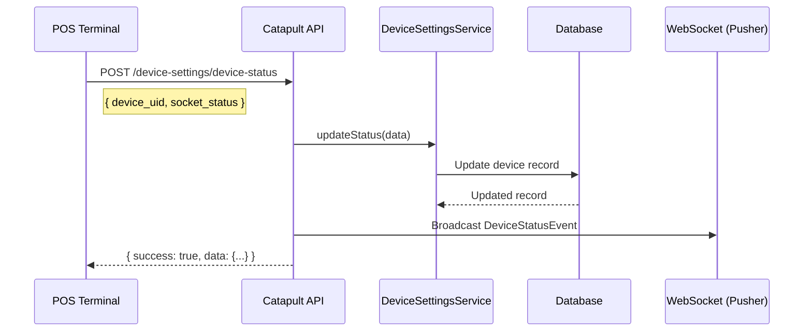
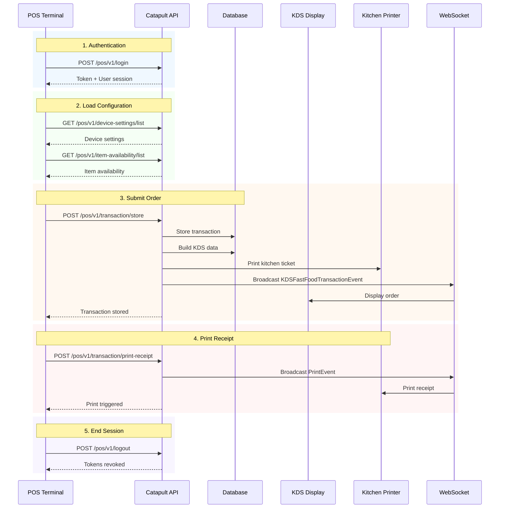
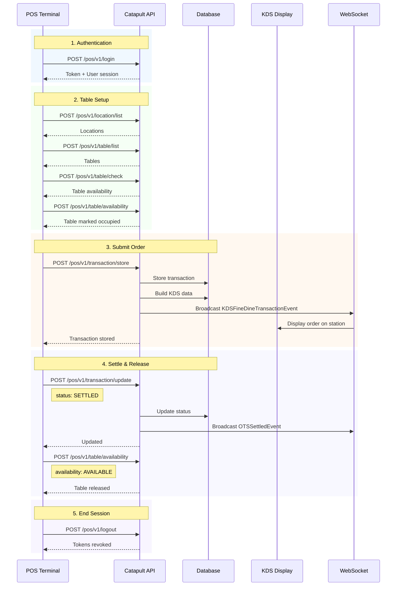

# POS API Documentation (v1)

## Overview

The POS (Point of Sale) API provides endpoints for terminal authentication, transaction management, item availability, table/location management, device settings, and receipt printing. All endpoints are prefixed with `/api/pos/v1`.

## Base URL

```
{HOST}/api/pos/v1
```

## Authentication

### Auth Flow



### Middleware: `pos-token`

All authenticated endpoints use the `pos-token` middleware which:

1. Extracts JWT from `Authorization: Bearer <token>` header
2. Validates the `pos` scope in JWT claims
3. Checks token exists in `oauth_access_tokens` table
4. Validates token expiration

### Headers

| Header | Value | Required |
|--------|-------|----------|
| `Authorization` | `Bearer <token>` | Yes (authenticated routes) |
| `Content-Type` | `application/json` | Yes |
| `Accept` | `application/json` | Yes |

---

## Standard Response Format

### Success Response

```json
{
  "success": true,
  "data": { ... },
  "message": "Operation message",
  "errors": [],
  "alert": false
}
```

### Error Response

```json
{
  "success": false,
  "data": [],
  "message": "Error description",
  "errors": ["error detail"],
  "alert": false
}
```

### Auth Response (Login/Logout)

```json
{
  "success": true,
  "data": { ... },
  "message": "Token Generated",
  "errors": [],
  "tokenResponseCode": "<TOKEN_GENERATED>"
}
```

---

## Endpoints

### 1. Authentication

#### POST `/login`

Authenticate a POS terminal or user.

**Supports two auth types:**

| Auth Type | Description |
|-----------|-------------|
| `device` | Device-based authentication using device UID |
| `user` | User credential authentication |

**Request Body (Device Auth):**

```json
{
  "auth_type": "device",
  "device_uid": "DEVICE-001",
  "device_type": "pos"
}
```

**Request Body (User Auth):**

```json
{
  "auth_type": "user",
  "username": "cashier01",
  "password": "secret"
}
```

**Response (200 OK):**

```json
{
  "success": true,
  "data": {
    "session": {
      "accessToken": "eyJ0eXAiOi...",
      "token": {
        "id": "token-id",
        "name": "pos-terminal",
        "expires_at": "2026-08-30T00:00:00.000000Z"
      }
    },
    "user": {
      "id": 1,
      "username": "cashier01",
      "status": "ACTIVE"
    },
    "auth_type": "user",
    "device": null
  },
  "message": "Token Generated",
  "errors": [],
  "tokenResponseCode": "<TOKEN_GENERATED>"
}
```

**Error Responses:**

| tokenResponseCode | Description |
|-------------------|-------------|
| `<INVALID_CREDENTIALS>` | Wrong username/password |
| `<USER_DEACTIVATED>` | Account is not active |
| `<DEVICE_NOT_FOUND>` | Device UID not registered |

---

#### POST `/logout`

Revoke all active tokens for the current session.

**Request Body:** None required

**Response (200 OK):**

```json
{
  "success": true,
  "data": [],
  "message": "Successfully logged out",
  "errors": [],
  "alert": false
}
```

---

### 2. Item Availability

#### POST `/item-availability/store`

Create or update item availability records.



**Request Body:**

```json
{
  "data": [
    {
      "item_id": 101,
      "available": true,
      "quantity": 50
    }
  ]
}
```

**Response (200 OK):**

```json
{
  "success": true,
  "data": { ... },
  "message": "Item availability successfully created",
  "errors": [],
  "alert": false
}
```

---

#### GET `/item-availability/list`

Retrieve item availability records.

**Query Parameters:**

| Parameter | Type | Description |
|-----------|------|-------------|
| `filters` | JSON string | Filter criteria (JSON-encoded) |

**Example:** `GET /item-availability/list?filters={"item_id":101}`

**Response (200 OK):**

```json
{
  "success": true,
  "data": [
    {
      "item_id": 101,
      "available": true,
      "quantity": 50
    }
  ],
  "message": "",
  "errors": [],
  "alert": false
}
```

---

### 3. Transactions

#### POST `/transaction/store`

Store new terminal transactions. This is the primary endpoint for submitting orders from the POS terminal to the KDS system.



**Request Body:**

```json
{
  "app_id": "cdis-kiosk",
  "app_key": "Y2Rpcy0xMTEy",
  "transaction": [
    {
      "date": "2026-07-30 16:29:21",
      "amount": 0,
      "transaction_type": 13,
      "device_type": "POS",
      "device_mode": 2,
      "table_id": -1,
      "device_mode_label": "Fine Dine",
      "is_zread": 0,
      "status": 1,
      "type": 1,
      "gross": 0,
      "total_quantity": 45,
      "total_free_items_amount": 0,
      "total_local_tax_amount": 0,
      "total_tax_amount": 0,
      "total_discount_amount": 0,
      "total_vat_exempt_amount": 0,
      "total_vat_deduct_amount": 0,
      "total_vatable_sales": 0,
      "total_zero_rated_sales": 0,
      "log_date": "2026-07-30",
      "order_number": "000000000007",
      "table_number": "6",
      "guest_count": "5",
      "transaction_id": "000000000007",
      "index": 0,
      "official_receipt": [
        {
          "split_number": 1,
          "number": 0,
          "total": 0,
          "discount_amount": 0,
          "free_items_amount": 0,
          "vat_deduct_amount": 0,
          "vat_exempt_amount": 0,
          "original_amount": 0,
          "quantity": 45,
          "local_tax_amount": 0,
          "tax_amount": 0,
          "service_charge": 0,
          "vatable_sales": 0,
          "zero_rated_sales": 0,
          "eligible_amount_to_earn_points": 0,
          "total_tender": 0,
          "loyalty_points_detail": [],
          "gift_with_purchase_detail": [],
          "index": 0,
          "payment_method": [],
          "si_reset_number": 0,
          "service_charge_percentage": 0,
          "manual_receipt": null,
          "product": [
            {
              "cart_bid": 9938940,
              "id": "1000000000000000140",
              "menu_code": "MNM0000001",
              "name": "S-CHOCOCHAMPORADO",
              "description": "S-CHOCOCHAMPORADO",
              "long_description": "S-CHOCOCHAMPORADO",
              "quantity": 1,
              "tax_percentage": 12,
              "is_free": 0,
              "is_vatable": 1,
              "original_price": 0,
              "price": 0,
              "total_addon": 0,
              "total_amount": 0,
              "amount_discount": 0,
              "vatable_sales": 0,
              "zero_rated_sales": 0,
              "tax": 0,
              "vat_exempt": 0,
              "vat_deduct": 0,
              "split_number": 1,
              "price_override_details": null,
              "entire_discount": 0,
              "supervisor_bid": null,
              "supervisor_name": null,
              "index": 0,
              "transaction_detail_bid": "000000000007",
              "product_bid": "1000000000000000140",
              "category_bid": "1000000000000000045",
              "category_name": "PANTRY",
              "order_type_id": 1,
              "order_type_name": "DINE IN",
              "bid": "000000000007",
              "created_at": "2026-07-30 16:29:21",
              "updated_at": "2026-07-30 16:29:21",
              "deleted_at": null,
              "discount": [],
              "is_modified": false,
              "addon": [],
              "special_request": "Add fresh milk"
            }
          ],
          "transaction_head_bid": "000000000007",
          "or_number": 0,
          "customer_type": 0,
          "customer_bid": "0",
          "customer_name": null,
          "customer_address": null,
          "cashier_bid": "1",
          "cashier_name": "bonfire-administrator",
          "bid": "000000000007",
          "clerk_bid": "-1",
          "clerk_name": null,
          "created_at": "2026-07-30 16:29:21",
          "updated_at": "2026-07-30 16:29:21",
          "deleted_at": null
        }
      ],
      "terminal_bid": "1000000000000000031",
      "bid": "000000000007",
      "created_by": "1",
      "updated_by": null,
      "created_at": "2026-07-30 16:29:21",
      "updated_at": "2026-07-30 16:29:21",
      "deleted_at": null
    }
  ]
}
```

**Request Parameters:**

| Parameter | Type | Required | Description |
|-----------|------|----------|-------------|
| `app_id` | string | Yes | Application identifier (e.g., "cdis-kiosk") |
| `app_key` | string | Yes | Application API key for authentication |
| `transaction` | array | Yes | Array of transaction objects to be stored |
| `transaction[].date` | string (datetime) | Yes | Transaction date and time (format: YYYY-MM-DD HH:MM:SS) |
| `transaction[].amount` | numeric | Yes | Total transaction amount |
| `transaction[].transaction_type` | integer | Yes | Type identifier for transaction (e.g., 13 for specific order type) |
| `transaction[].device_type` | string | Yes | Device type (e.g., "POS") |
| `transaction[].device_mode` | integer | Yes | Device mode (1=Fast Food, 2=Fine Dine) |
| `transaction[].table_id` | integer | Yes | Table identifier (-1 if not applicable) |
| `transaction[].device_mode_label` | string | Yes | Human-readable device mode label |
| `transaction[].is_zread` | integer | Yes | Z-read flag (0 or 1) |
| `transaction[].status` | integer | Yes | Transaction status code |
| `transaction[].type` | integer | Yes | Transaction type code |
| `transaction[].gross` | numeric | Yes | Gross amount before tax/discounts |
| `transaction[].total_quantity` | integer | Yes | Total quantity of items in transaction |
| `transaction[].total_free_items_amount` | numeric | Yes | Total amount of free items |
| `transaction[].total_local_tax_amount` | numeric | Yes | Total local tax amount |
| `transaction[].total_tax_amount` | numeric | Yes | Total tax amount |
| `transaction[].total_discount_amount` | numeric | Yes | Total discount amount |
| `transaction[].total_vat_exempt_amount` | numeric | Yes | Total VAT exempt amount |
| `transaction[].total_vat_deduct_amount` | numeric | Yes | Total VAT deductible amount |
| `transaction[].total_vatable_sales` | numeric | Yes | Total vatable sales |
| `transaction[].total_zero_rated_sales` | numeric | Yes | Total zero-rated sales |
| `transaction[].log_date` | string (date) | Yes | Log date (format: YYYY-MM-DD) |
| `transaction[].order_number` | string | Yes | Order number identifier |
| `transaction[].table_number` | string | No | Table number for dine-in orders |
| `transaction[].guest_count` | string | No | Number of guests at table |
| `transaction[].transaction_id` | string | Yes | Unique transaction identifier |
| `transaction[].index` | integer | Yes | Index position in transaction array |
| `transaction[].official_receipt` | array | Yes | Array of official receipt records |
| `transaction[].official_receipt[].split_number` | integer | Yes | Receipt split number |
| `transaction[].official_receipt[].product` | array | Yes | Array of product items in receipt |
| `transaction[].official_receipt[].product[].name` | string | Yes | Product name |
| `transaction[].official_receipt[].product[].quantity` | integer | Yes | Quantity of product |
| `transaction[].official_receipt[].product[].price` | numeric | Yes | Unit price of product |
| `transaction[].official_receipt[].product[].special_request` | string | No | Special instructions for product |
| `transaction[].terminal_bid` | string | Yes | Terminal business ID identifier |

**Response (200 OK):**

```json
{
  "success": true,
  "data": {
    "terminal_bid": "1000000000000000031",
    "date": "2026-07-30 16:29:21",
    "transaction_id": "000000000007",
    "transaction_type": 13,
    "log_date": "2026-07-30",
    "amount": 0,
    "is_zread": 0,
    "type": 1,
    "status": 1,
    "gross": 0,
    "total_quantity": 45,
    "total_free_items_amount": 0,
    "total_tax_amount": 0,
    "total_local_tax_amount": 0,
    "total_discount_amount": 0,
    "total_vat_deduct_amount": 0,
    "total_vat_exempt_amount": 0,
    "total_vatable_sales": 0,
    "total_zero_rated_sales": 0,
    "order_number": "000000000007",
    "table_number": "6",
    "guest_count": "5",
    "created_by": "1",
    "bid": "1016000000000000032",
    "updated_at": "2026-07-30 16:29:27",
    "created_at": "2026-07-30 16:29:27",
    "device_mode": 2,
    "table_id": -1,
    "is_settled": false,
    "official_receipt": {
      "transaction_head_bid": "1016000000000000032",
      "or_number": 0,
      "split_number": 1,
      "total": 0,
      "discount_amount": 0,
      "quantity": 45,
      "products": [
        {
          "transaction_detail_bid": "1016000000000000026",
          "product_bid": "1000000000000000140",
          "name": "S-CHOCOCHAMPORADO",
          "menu_code": "MNM0000001",
          "category_name": "PANTRY",
          "quantity": "1.000000",
          "price": "0.000000",
          "special_request": "Add fresh milk",
          "bid": "1016000000000000115",
          "updated_at": "2026-07-30 16:29:27",
          "created_at": "2026-07-30 16:29:21",
          "addons": []
        }
      ]
    },
    "kds_transaction": {
      "bid": "1016000000000000032",
      "terminal_bid": "1000000000000000031",
      "terminal_number": "001",
      "transaction_id": "000000000007",
      "date": "2026-07-30 16:29:21",
      "order_number": "000000000007",
      "table_number": "6",
      "guest_count": "5",
      "cashier_name": "bonfire-administrator",
      "created_at": "2026-07-30T08:29:27Z",
      "updated_at": "2026-07-30T08:29:27Z"
    }
  },
  "message": "Terminal Transaction successfully created.",
  "errors": [],
  "tokenResponseCode": false
}
```

**Response Fields:**

| Field | Type | Description |
|-------|------|-------------|
| `success` | boolean | Indicates successful operation |
| `data` | object | Response data containing transaction details |
| `data.terminal_bid` | string | Terminal business ID |
| `data.transaction_id` | string | Created transaction identifier |
| `data.bid` | string | Business transaction BID |
| `data.created_at` | string | Transaction creation timestamp |
| `data.official_receipt` | object | Receipt details with products |
| `data.kds_transaction` | object | Kitchen Display System transaction data |
| `message` | string | Operation success message |
| `errors` | array | Array of error messages (empty if successful) |
| `tokenResponseCode` | boolean/string | Token response code |

**Validation:**
- `transaction` must not be empty
- Each transaction's `terminal_bid` must correspond to an existing `CDISTerminal` record
- `app_id` and `app_key` must be valid credentials
- `date` and `log_date` formats must be valid datetime/date strings

---

#### POST `/transaction/update`

Update transaction status (e.g., void, settle, cancel).



**Request Body:**

```json
{
  "data": {
    "transaction_id": 1,
    "status": "SETTLED"
  }
}
```

**Response (200 OK):**

```json
{
  "success": true,
  "data": { ... },
  "message": "",
  "errors": [],
  "alert": false
}
```

**Error Response (missing params):**

```json
{
  "success": false,
  "data": [],
  "message": "Missing request parameters",
  "errors": [],
  "alert": false
}
```

---

#### POST `/transaction/search`

Search transactions with filters.

**Request Body:**

```json
{
  "filters": {
    "terminal_bid": "TXN-2026-001",
    "payments": {
      "payment_type": "CASH"
    }
  }
}
```

**Response (200 OK):**

```json
{
  "success": true,
  "data": [
    {
      "id": 1,
      "terminal_bid": "TXN-2026-001",
      "details": [
        {
          "product_id": 101,
          "product_name": "Burger",
          "usage_type": "PRODUCT"
        }
      ]
    }
  ],
  "message": "",
  "errors": [],
  "alert": false
}
```

> **Note:** Transaction search automatically filters details with `usage_type = PRODUCT`.

---

#### POST `/transaction/print-receipt`

Trigger receipt printing via WebSocket broadcast.



**Request Body:**

```json
{
  "source": "pos-terminal-01",
  "content": "<receipt data>"
}
```

**Response (200 OK):**

```json
{
  "success": true,
  "data": { ... },
  "message": "",
  "errors": [],
  "alert": false
}
```

---

#### GET `/transaction/list`

Retrieve transactions with optional filters.

**Query Parameters:**

| Parameter | Type | Description |
|-----------|------|-------------|
| `filters` | JSON string | Filter criteria (JSON-encoded) |

**Response (200 OK):**

```json
{
  "success": true,
  "data": [ ... ],
  "message": "",
  "errors": [],
  "alert": false
}
```

---

### 4. Table Management

#### POST `/table/list`

Retrieve tables for a location.



**Request Body:**

```json
{
  "location_id": 1,
  "data": {
    "swap_id": "optional-swap-identifier"
  }
}
```

**Response (200 OK):**

```json
{
  "success": true,
  "data": [
    {
      "id": 1,
      "table_ref": "T01",
      "location_id": 1,
      "seat_number": 4,
      "is_available": 1
    }
  ],
  "message": "Tables fetched successfully",
  "errors": [],
  "alert": false
}
```

---

#### POST `/location/list`

Retrieve all locations.

**Request Body:**

```json
{
  "data": {
    "swap_id": "optional-swap-identifier"
  }
}
```

**Response (200 OK):**

```json
{
  "success": true,
  "data": [
    {
      "id": 1,
      "location_name": "Ground Floor",
      "no_of_tables": 10,
      "no_of_seats": 40,
      "status": 1
    }
  ],
  "message": "Locations fetched successfully",
  "errors": [],
  "alert": false
}
```

---

#### POST `/table`

Create or update table records. Requires valid `app_key`.

**Request Body:**

```json
{
  "app_key": "<catapult-app-key>",
  "data": [
    {
      "id": 0,
      "location_id": 1,
      "table_ref": "T01",
      "seat_number": 4,
      "status": 1,
      "is_available": 1,
      "position_x": 100.0,
      "position_y": 200.0,
      "width": 50.0,
      "height": 50.0,
      "angle": 0.0
    }
  ]
}
```

**Validation Rules:**

| Field | Rules |
|-------|-------|
| `id` | required, integer, min:0 (`0` = create new) |
| `location_id` | required, integer, min:1 |
| `table_ref` | required, string, max:255 |
| `seat_number` | required, integer, min:0 |
| `status` | required, integer |
| `is_available` | required, integer |
| `position_x` | nullable, numeric |
| `position_y` | nullable, numeric |
| `width` | nullable, numeric |
| `height` | nullable, numeric |
| `angle` | nullable, numeric |

**Response (200 OK):**

```json
{
  "success": true,
  "data": [ ... ],
  "message": "Tables saved successfully",
  "errors": [],
  "alert": false
}
```

---

#### POST `/location`

Create or update location records. Requires valid `app_key`.

**Request Body:**

```json
{
  "app_key": "<catapult-app-key>",
  "data": [
    {
      "id": 0,
      "location_name": "Ground Floor",
      "no_of_tables": 10,
      "no_of_seats": 40,
      "status": 1
    }
  ]
}
```

**Validation Rules:**

| Field | Rules |
|-------|-------|
| `id` | required, integer, min:0 |
| `location_name` | required, string, max:255 |
| `no_of_tables` | nullable, integer, min:0 |
| `no_of_seats` | nullable, integer, min:0 |
| `status` | required, integer |

**Response (200 OK):**

```json
{
  "success": true,
  "data": [ ... ],
  "message": "Table locations saved successfully",
  "errors": [],
  "alert": false
}
```

---

#### POST `/table/availability`

Update table availability status.

**Request Body:**

```json
{
  "id": 1,
  "location_id": 1,
  "availability": "AVAILABLE"
}
```

| Field | Rules |
|-------|-------|
| `id` | nullable, integer, min:1, required without `name` |
| `name` | nullable, string, max:255, required without `id` |
| `location_id` | required, integer, min:1 |
| `availability` | required, must be valid enum value |

---

#### POST `/table/check`

Check table availability status.

**Request Body:**

```json
{
  "id": 1,
  "location_id": 1
}
```

| Field | Rules |
|-------|-------|
| `id` | required without `name` |
| `name` | required without `id` |
| `location_id` | nullable |

---

#### POST `/transaction/availability`

Update transaction availability status.

**Request Body:**

```json
{
  "bid": "TXN-2026-001",
  "availability": "OCCUPIED"
}
```

| Field | Rules |
|-------|-------|
| `bid` | required without `transaction_id` |
| `transaction_id` | required without `bid` |
| `availability` | required, must be valid enum value |

---

#### POST `/transaction/check`

Check transaction availability status.

**Request Body:**

```json
{
  "bid": "TXN-2026-001"
}
```

| Field | Rules |
|-------|-------|
| `bid` | required without `transaction_id` |
| `transaction_id` | required without `bid` |

---

### 5. Device Settings

#### GET `/device-settings/list`

Retrieve all registered POS device settings. Devices inactive for more than 5 minutes are automatically marked offline.



**Response (200 OK):**

```json
{
  "success": true,
  "data": [
    {
      "id": 1,
      "device_uid": "DEVICE-001",
      "device_type": "pos",
      "socket_status": 1,
      "last_connected_at": "2026-07-30T10:00:00Z"
    }
  ],
  "message": "",
  "errors": [],
  "alert": false
}
```

---

#### POST `/device-settings/device-status`

Update device connection status and broadcast to all listeners.



**Request Body:**

```json
{
  "device_uid": "DEVICE-001",
  "socket_status": 1
}
```

---

#### POST `/device-settings/print-status`

Update device print status and broadcast to all listeners.

**Request Body:**

```json
{
  "device_uid": "DEVICE-001",
  "print_status": 1
}
```

---

## Complete Request Flow

### Full POS Transaction Lifecycle (Fast Food)



### Full POS Transaction Lifecycle (Fine Dine)



---

## Route Summary

| Method | Endpoint | Auth | Description |
|--------|----------|------|-------------|
| POST | `/login` | No | Authenticate device or user |
| POST | `/logout` | No | Revoke session tokens |
| POST | `/item-availability/store` | Yes | Store item availability |
| GET | `/item-availability/list` | Yes | List item availability |
| POST | `/transaction/store` | Yes | Create new transaction(s) |
| POST | `/transaction/update` | Yes | Update transaction status |
| POST | `/transaction/search` | Yes | Search transactions |
| POST | `/transaction/print-receipt` | Yes | Trigger receipt print |
| GET | `/transaction/list` | Yes | List transactions |
| POST | `/table/list` | Yes | List tables by location |
| POST | `/location/list` | Yes | List all locations |
| POST | `/table` | Yes | Upsert table records |
| POST | `/location` | Yes | Upsert location records |
| POST | `/table/availability` | Yes | Update table availability |
| POST | `/table/check` | Yes | Check table availability |
| POST | `/transaction/availability` | Yes | Update transaction availability |
| POST | `/transaction/check` | Yes | Check transaction availability |
| POST | `/device-settings/device-status` | Yes | Update device status |
| POST | `/device-settings/print-status` | Yes | Update print status |
| GET | `/device-settings/list` | Yes | List all devices |

---

## WebSocket Events

The POS API triggers the following broadcast events:

| Event | Channel | Triggered By |
|-------|---------|-------------|
| `KDSFastFoodTransactionEvent` | KDS channel | `transaction/store` (fast food) |
| `KDSFineDineTransactionEvent` | KDS channel | `transaction/store` (fine dine) |
| `OTSSettledEvent` | OTS channel | `transaction/store` (settlement) |
| `PrintEvent` | Printer channel | `transaction/print-receipt` |
| `DeviceStatusEvent` | Device channel | `device-settings/device-status`, `device-settings/print-status` |

---

## Error Codes

| HTTP Status | Scenario |
|-------------|----------|
| 200 | Success (check `success` field in body) |
| 401 | Missing or invalid token |
| 403 | Token scope mismatch |
| 422 | Validation error |
| 500 | Internal server error |

Token-specific error codes returned in `tokenResponseCode`:

| Code | Description |
|------|-------------|
| `<TOKEN_GENERATED>` | Login successful |
| `<INVALID_CREDENTIALS>` | Bad username/password |
| `<USER_DEACTIVATED>` | Account disabled |
| `<DEVICE_NOT_FOUND>` | Unregistered device |
| `<TOKEN_REQUIRED>` | No authorization header |
| `<INVALID_TOKEN>` | Token not found in DB |
| `<EXPIRED_TOKEN>` | Token has expired |
| `<MALFORMED_TOKEN>` | JWT parse failure |
